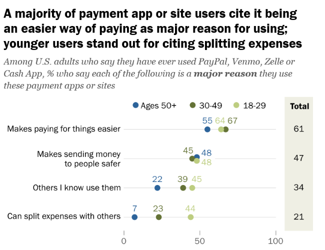

# **A Deep Dive Into Venmo**

## Overview and Origin
### What is the name of the company?
Venmo is a peer to peer payment service company owned by Paypal. The current valuation for Venmo is $38 billion dollars.

### When was the company incorporated?
Venmo was founded in August 2009, and was publicly launched in March 2012.

### Who are the founders of the company?
Andrew Kortina and Iqram Magdon-Ismail are co-founders of Venmo. They originally met freshman year at the University of Pennsylvania. They were assigned as random roommates, and the pair were both studying computer science at the start of college. Although Kortina ended up studying in “Philosophy and Creative Writing and minors in Computer Science and Logic”, he kept an interest in computer science. The two remained friends throughout college, and post graduation. 

### How did the idea for the company come about?
Upon graduation, Kortina and Magdon-Ismail built websites for small businesses in West Philly. Simultaneously during this period the pair worked on startup projects such as “a realtime
website analytics tool called Swooge and a web based music selling platform, Philafunk.” Kortina moved on to work at Betaworks, and Magdon-Ismail worked for Ticketleap. Both were ready to work on a project of their own, which led to them meeting on the weekends to work on potential ideas.The idea for the company was born when Magdon-Ismail visited Kortina in New York City, and forgot his wallet in Philadelphia. Kortina paid for Magdon-Ismail expenses for the weekend, and Magdon-Ismail paid Kortina back via check. The process of writing and later depositing the check was a nuisance to both parties, which led both to believe there should be a better way to send money to each other. Paypal was available, but not utilized by the pair or any of their friends. The duo set out to solve this problem, which led to the first prototype of Venmo which was through SMS.

### How is the company funded?
The company received an initial investment of $1.2 million in 2010 from various sources such as, but not limited to, Betaworks, IA Ventures, Lerer Hippeau, and angel investors. In 2012 they were acquired for $26.2 million by Braintree. A year later, Braintree was acquired by PayPal for $800 million. Currently, they are steadily growing under PayPal.

## Business Activities
### What specific financial problem is the company trying to solve?
From its inception, Venmo had always intended to be a SMS-based communication and transfer service, initially focused on files. In Origins of Venmo, Kortina writes of a moment where his co-founder lost his wallet, leading to the two struggling to finalize their account balances after Kortina covered for his co-founder during the course of a weekend of going out. After contemplating the painstaking departure of “[finding] a checkbook… and [going] to the bank… to cash it” and realizing the lack of incentive to use PayPal, the idea for Venmo was born. Andrew Kortina and Iqram Magdon-Ismail set out to “build a way to pay each other back that [felt] consistent with all of the other experiences [they used] in apps we use with [their] friends.” By filling this now seemingly saturated vertical, the two took the first steps and paved the way for other payments and transactions applications, eventually leading to one of Fintech’s most focused-on trends at the moment: mobile banking. Accordingly, Venmo too, has shifted its focus, and now, ironically, allows users to cash checks with a few photos. These features of Venmo have been successful in realizing the co-founders’ objective of streamlining online transactions.

### Who is the company's intended customer? Is there any information about the market size of this set of customers?
Venmo was originally designed to be used amongst family and friends, but since has expanded to service businesses and offer products such as the Venmo Mastercard Debit Card. The applications users are primarily Millennials and Gen Z, but “is used by a majority of U.S. adults (57%)”. Younger users are attracted to the convenience of the application. Venmo is expanding its customer base to teenagers because “The company has estimated that before the new Teen Account was launched, 9 million teenagers were using Venmo through their parents”. The number of users is "predicted to rise by 7.2% and 6.5%, to a total of 91.2 million and 97.1 million in 2024 and 2025, respectively”.

### What solution does this company offer that their competitors do not or cannot offer?
Venmo offers a social platform through their mobile app their competitors do not. Users are able to view public transactions made by their social circle, which makes the app more popular amongst Millennials. While some find the social element appealing, an individual's financial transactions are on display which others may view as an invasion of privacy.

### Which technologies are they currently using, and how are they implementing them?
Venmo is a fast-moving, multinational corporation with hundreds of employees and teams. To enable efficiency, Venmo lets teams choose the technologies they use and how they implement them, resulting in nearly thousands that are nameable. Many of these are listed on their GitHub engineering blog, although a bit outdated. Nonetheless, other more current sources suggest Venmo uses well-known Fintech APIs like Dosh and Plaid. I believe these are the most notable technologies to highlight as a result of their instrumentality in Venmo’s tech stack, as these two companies allow Venmo to interact with various banks, seamlessly, by automating the work surrounding compliance and uniformity across the many banks customers need access to. Below is a list of a variety of "open source libraries" Venmo utilizes. 

## Landscape
### What domain of the financial industry is the company in?
Venmo is within the peer-to-peer payments and transactions domain of the financial industry.

### What have been the major trends and innovations of this domain over the last 5-10 years?
This domain has evolved significantly over the last ten years. The widespread adoption of smartphones supported the growth of P2P companies such as Venmo. Security of P2P platforms “have made tremendous advancements in this area, using cutting-edge encryption techniques, multi-factor authentication, and biometric verification systems to safeguard user information.” The emergence of digital wallets also helped develop more flexibility and convenience for users. The rise in popularity of cryptocurrencies pressured P2P companies to incorporate them into their platforms. For example, Venmo and Cashapp offer ways to purchase Bitcoin through their apps. 

### What are the other major companies in this domain?
Venmo was at the forefront of P2P payment services, but a plethora of competitors have emerged since its inception. Venmo’s main competitor is Zelle, which is owned by a collective of U.S. banks, offers a similar service. Through Zelle users can send money online directly to the recipient's bank account free of charge. Zelle also has the added convenience of not requiring the user to download its app, one can simply use Zelle through their financial institutions app. Another major competitor to Venmo is Cashapp. It is another P2P payment app based in the U.S., that offers transactions between users at no cost. Cashapp “also offers the option to purchase stocks and bitcoin through its platform”. Apple also launched its own payment service Apple Cash in 2017. Apple cash allows users to send money via messages, which is similar to the first prototype of Venmo. Other competitors include, but are not limited to, Google Pay, PayPal, Samsung Pay, Stripe, and Square Cash. 

## Results
### What has been the business impact of this company so far?
In April 2022, Paypal, Venmo’s parent company, released a summarization of some of Venmo’s financial impact. This included some statistics about Venmo’s financial impact in the historical near term. For example, “[in] Q2 2022, Venmo grew 50% and now has nearly 90 million accounts in the U.S.” and “commerce payment volume on Venmo grew >250%.” This suggests the impact of Venmo continues to grow, with no signs of it slowing down.

### What are some of the core metrics that companies in this domain use to measure success? How is your company performing based on these metrics?
Although there are a range of KPIs tracking various subsets of P2P services, the bottom line of these services is impacted entirely by the number of users they have, thus user-based statistics are of utmost importance for P2P payments services to track. As per USA Today, in 2017 Venmo had 17.3% of Market Share, rising to 38.7% by 2022. For comparison, Zelle has grown from 15.8% of market share to 56.1%, and Square Cash has grown from 6.9% to 16.2%.

### How is your company performing to competitors in the same domain?
As per Business of Apps, Zelle did slightly more than three times the total payment volume of Cashapp and Venmo in 2022, a 20% increase in their volume over 2021. In comparison, Venmo’s total payment volume declined since 2021, and Cashapp grew in TPV only slightly. That said, Venmo has more daily active users than either platform, as per Insider Intelligence, and is projected to show a consistently larger annual growth rate in this regard. For P2P payment applications, Daily Active Users likely has more significance to the business than does the total payment volume.

## Recommendations
### If you were to advise the company, what products or services would you suggest they offer?
If I were to advise the company, I would suggest adding personal finance courses as I believe this could improve customer acquisition in existing segments that Venmo predominantly serves (as per the Pew Research Center). These customer segments already seek self-education. By coupling the completion of  the personal finance course with an exclusive Cashback rewards program, Venmo could also bolster customer retention. 

### Why do you think offering this product or service would benefit the company?
Given that PayPal owns Venmo, it would be ideal for Venmo to focus on the unique consumer behaviors of its most active customer segment, as both services allow for types of P2P transacting. The differentiation in the two products allows PayPal to expand the total number of customers served. 

### What technologies would this additional product or service utilize?
Live-streaming services would be necessary to integrate into Venmo’s mobile suite, as certain assurances would be required around a consumer’s consumption of course material. Access to the Cashback program should be granted to consumers based on some merit in relation to learned skills and knowledge from the course, requiring a custom event stream and specific database logic.

### Why are these technologies appropriate for your solution?
Venmo’s customers generally use their mobile clients to interact with Venmo’s service. The proposed solution is a minimal effort introduction into the application’s piping, allowing for easy scaling overtime if it demonstrates success.

## References
https://en.wikipedia.org/wiki/Venmo#:~:text=Their%20original%20prototype%20sent%20money,by%20Braintree%20for%20%2426.2%20million
https://www.businessofapps.com/data/venmo-statistics/#:~:text=Venmo%20started%20out%20in%202009,to%20keep%20track%20of%20payments.\
https://kortina.nyc/essays/origins-of-venmo/
https://techcrunch.com/2010/09/16/venmo-1-2-million-iphone/
https://archive.nytimes.com/bits.blogs.nytimes.com/2012/08/16/payments-start-up-braintree-buys-venmo-for-26-2-million/
https://techcrunch.com/2013/09/26/paypal-acquires-payments-gateway-braintree-for-800m-in-cash/
https://stackshare.io/venmo/venmo
https://www.openbankingtracker.com/provider/venmo/technologies
https://awesometechstack.com/analysis/website/venmo.com/
https://venmo.github.io
https://newsroom.paypal-corp.com/2022-08-18-Consumers-Are-More-Likely-to-Complete-a-Purchase-with-Venmo-Over-Traditional-Payment-Methods
https://easy-software.com/en/newsroom/the-p2p-process-in-figures-the-10-most-important-kpis-at-a-glance/
https://www.usatoday.com/story/money/markets/2018/07/14/top-mobile-peer-to-peer-payment-platforms-venmo-cash-app-zelle/36726065/
https://www.pewresearch.org/short-reads/2022/09/08/payment-apps-like-venmo-and-cash-app-bring-convenience-and-security-concerns-to-some-users/
https://www.insiderintelligence.com/content/zelle-carries-momentum-thanks-network-capability-expansions
https://www.pewresearch.org/short-reads/2022/09/08/payment-apps-like-venmo-and-cash-app-bring-convenience-and-security-concerns-to-some-users/
https://www.usesignhouse.com/blog/venmo-stats#:~:text=Venmo%20was%20acquired%20by%20PayPal,by%20the%20end%20of%202023.
https://www.investopedia.com/articles/personal-finance/010715/venmo-its-business-model-and-competition.asp
https://help.venmo.com/hc/en-us/articles/217532097-Can-I-use-Venmo-to-buy-or-sell-merchandise-goods-or-services-#:~:text=Venmo%20was%20originally%20designed%20for,varying%20needs%20of%20our%20customers
https://risewithaurora.com/blog/venmo-everything-you-need-to-know
https://venmo.com/about/debitcard/
https://businessmodelanalyst.com/who-owns-venmo/#:~:text=From%202002%20to%202015%2C%20eBay,Venmo%2C%20Braintree%2C%20and%20PayPal.
https://www.forbes.com/sites/moorinsights/2023/07/10/paypal-makes-strategic-moves-with-expansion-of-venmo-offerings/?sh=5ca0532042c1
https://www.oberlo.com/statistics/how-many-people-use-venmo#:~:text=In%202023%2C%20the%20company%20is,in%202024%20and%202025%2C%20respectively.
https://www.theguardian.com/lifeandstyle/2021/aug/10/venmo-public-financial-transactions-friends
https://www.forbes.com/advisor/money-transfer/what-is-cash-app/
https://squareup.com/us/en/press/introducing-cashtags
https://www.financemagnates.com/fintech/payments/the-latest-developments-in-p2p-payment-platforms/

